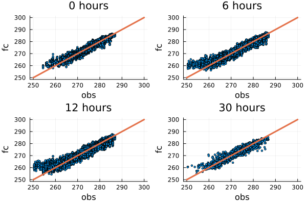

# Plots 


```julia
using VfldFiles, Glob, Plots, DataFrames

vobsfiles = glob("vobs*",obs)
vfldfiles = glob("vfld*",MEPS_prod)


obs_df = reduce(vcat, read_v.(vobsfiles,select=[:ID,:TT]))
vfld_df = reduce(vcat, read_v.(vfldfiles,select=[:ID,:TT]))

vobsfld = innerjoin(vfld_df,obs_df,on=[:ID,:validtime],makeunique=true)

gdf=groupby(vobsfld,[:leadtime])

function plotind(gdf,i)
    p = scatter(gdf[i][:,:TT_1],gdf[i][:,:TT],legend=false,markersize=2);
    title!(p,string((keys(gdf)[i]).leadtime))
    plot!(p,[250, 300],[250, 300],linewidth=3)
    xlabel!(p,"obs")
    ylabel!(p,"fc")

    return p 
end 


plot(plotind(gdf,1), plotind(gdf,3), plotind(gdf,5), plotind(gdf,11), layout=grid(2,2))
```


